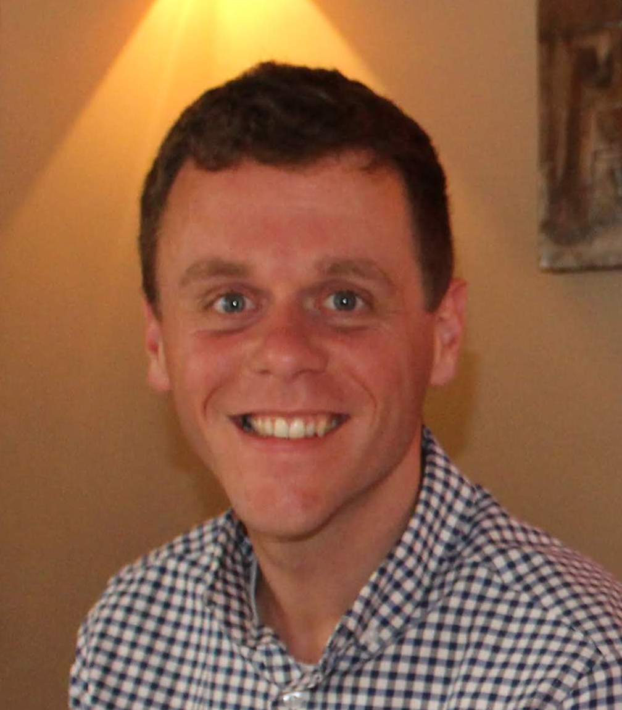

{: width="35%" style="float:right; padding:8px"}

I am a data scientist working at Datasparq.

In my [past](/about), I have been a researcher
at the University of Oxford and the Alan Turing Institute,
specialising in
mathematical modelling and simulation
(mainly of biological and social phenomena),
Bayesian inference and machine learning,
and systems/control theory.

This site covers my public academic work.

## Current Affiliation

[Datasparq](https://datasparq.ai), 29 Clerkenwell Road, London, EC1M 5RN

## Contact

`tpprescott@gmail.com`
